# Creating a ASP.NET MVC application to deploy to Azure App Service

This is an ASP.NET MVC application that uses Entity Framework Core for data access.

## Project Setup

Here are the steps to create the project and install dependencies (using either GitHub Codespace or VS Code):

1. **Open Codespace** Select the green code button in the repo and switch to the 'Codespaces' tab. Click on the 'Create codespace on main' button.

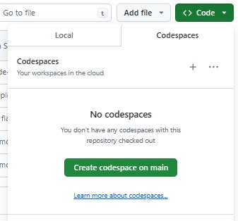

The codespace will open and the extensions that are referenced in the devcontainer.json file will be loaded, i.e. GitHub Copilot and GitHub Copilot Chat. 

2. **Open the terminal window** Select the 3 horizonal lines at the top left of the codespace and open a new terminal window. This may also be under the top view menu. 

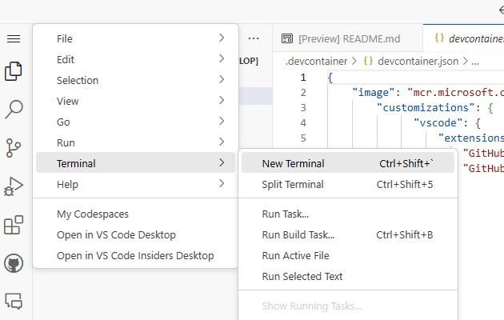

3. **Create the ASP.NET MVC project**
    Create a new ASP.NET MVC project named `MVCAspNetApp` [Replace this with your preferred name] using the .NET CLI with the following command:

    ```bash
    dotnet new mvc -o MVCAspNetApp
    ```
This will create a folder structure as shown:


4. **Navigate to the project directory** Navigate into the newly created project directory:
```bash
cd MVCAspNetApp
```

5. **Install the EF Core CLI** Install the Entity Framework Core command-line interface:
```bash
dotnet tool install --global dotnet-ef
```

6. **Add Entity Framework Core** Add the Entity Framework Core package to your project:
```bash
dotnet add package Microsoft.EntityFrameworkCore
```

7. **Add Entity Framework Core SQLServer** Add the Entity Framework Core SqlServer package to your project:
```bash
dotnet add package Microsoft.EntityFrameworkCore.SqlServer
```

8. **Add Entity Framework Core Tools** Add the Entity Framework Core Tools package to your project:
```bash
dotnet add package Microsoft.EntityFrameworkCore.Tools
```

9. **Update the appsettings.json file** Add your connection string to the appsettings.json file:
```bash
"ConnectionStrings": {
    "DefaultConnection": "Your_Connection_String_Here"
}
```

To get the connection string, you must have completed the deployment as described in https://github.com/hackathon-white-camel-26/deployAzureResources. Once you have executed the workflow, the SQL Server and Database will be available in the Azure portal (https://portal.azure.com/).

Navigate to the resource group that was created and select the SQL database

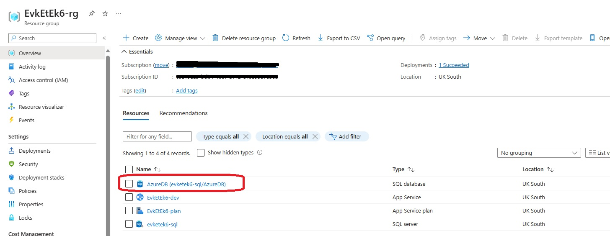

Select Connection Strings under Settings and copy the value of the string:

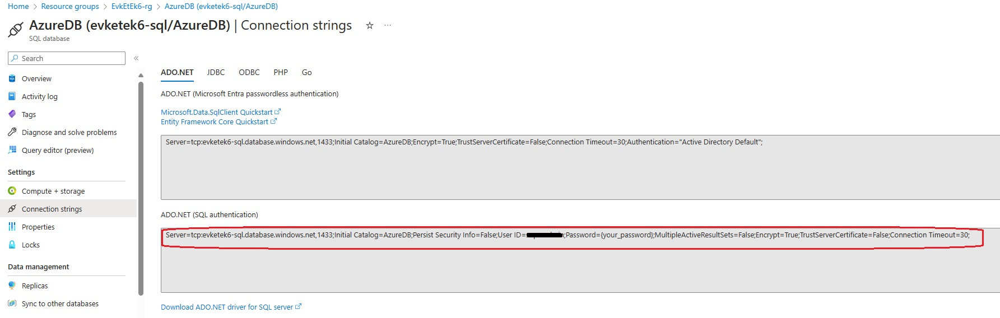

Paste this value into the appsettings.json file as the value for 'DefaultConnection'. Ensure that you update the value of the password. 

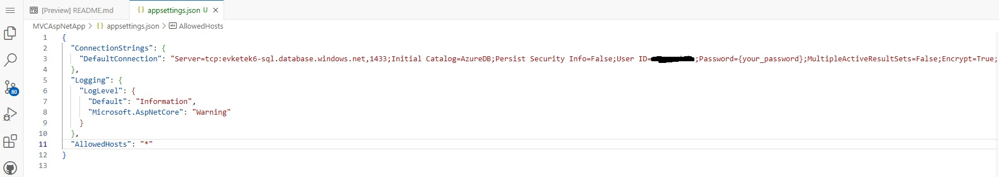

10. **Create the models** 

**Create a `User` class.** Ask GitHub Copilot Chat to 'create a User class in the Models folder with properties for Id, last_name, first_name, email. Set Id field as primary key using dataannotations'

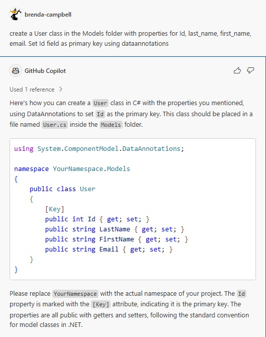

Select the three dots above the generate code and insert into a new file

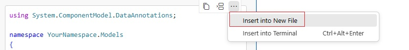

Replace the value for 'YourNamespace' with the correct value based on your project name, i.e. MVCAspNetApp.Models. Save the file into the Models folder as User.cs

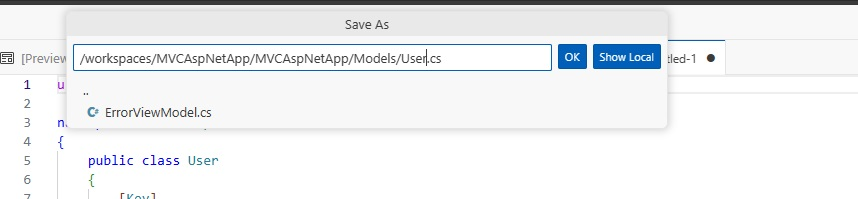

**Create a `Quiz` class.** Ask GitHub Copilot Chat to 'create a Quiz class with properties for Id, title using dataannotations and ID is primary key'.

Select the three dots above the generate code and insert into a new file.

If needed, replace the value for 'YourNamespace' with the correct value based on your project name, i.e. MVCAspNetApp.Models. You may notice that GitHub Copilot starts to follow the pattern and is using the correct namespace. Save the file into the Models folder as Quiz.cs

**Create a `QuizQuestion` class** Ask GitHub Copilot Chat 'create a QuizQuestion class to with properties for Id, QuizId, text using dataannotations where Id is primary key and QuizId is foreign key'

Select the three dots above the generate code and insert into a new file.

Save the file into the Models folder as QuizQuestion.cs

**Create a `QuizQuestionOption` class** Ask GitHub Copilot Chat 'create a QuizQuestionOption class to with properties for Id, QuizQuestion_Id, text, is_correct where Id is primary key and QuizQuestion_Id is foreign key'.
Note that I am not referencing dataannotations anymore as GitHub Copilot is using the context of what I am doing. 

Select the three dots above the generate code and insert into a new file.

Save the file into the Models folder as QuizQuestionOption.cs

**Create a `QuizUserAnswer` class** Ask GitHub Copilot Chat 'create a QuizUserAnswer class to with properties for Id, QuizQuestionId, QuizQuestionOption_id

Select the three dots above the generate code and insert into a new file.

Save the file into the Models folder as QuizUserAnswer.cs

Ensure that you have updated the value of 'YourNamespace' with the correct value based on your project name, i.e. MVCAspNetApp.`Models`

Your models folder should contain 5 new classes as shown:

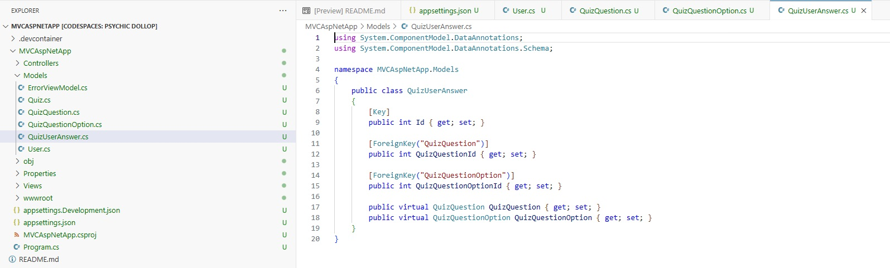

11. **Create the ApplicationDbContext class** 

Create an `ApplicationDbContext` class in the Data folder. This class is used to interact with the database using Entity Framework Core. Create a new folder called 'Data' 
Ask GitHub Copilot Chat 'create a ApplicationDbContext class that implements DBContext with DBSet for User, Quiz, QuizQuestion, QuizQuestionOption and QuizUserAnswer'.

Select the three dots above the generate code and insert into a new file. Update the value of 'YourNamespace' if needed, i.e. MVCAspNetApp.`Data`. Also ensure that there is a reference to the Models so the first 2 lines should be:

```bash
using MVCAspNetApp.Models;
using Microsoft.EntityFrameworkCore;
```

Save the file into the Data folder as ApplicationDbContext.cs

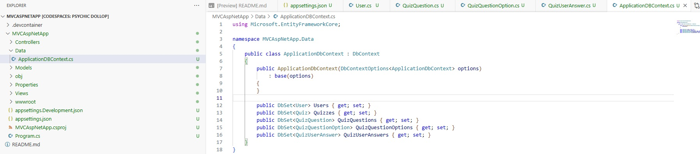

12. **Update the Program.cs file** Update the Program.cs file to use the connection string from the appsettings.json file and the ApplicationDbContext class.

At top of the class (first line) add the reference to the Data i.e. using YourNamespace.Data;

```bash
using MVCAspNetApp.Data;
using Microsoft.EntityFrameworkCore;
```
After line 6, i.e. builder.Services.AddControllersWithViews(); start typing 'buil.' to add the DbContext as shown below:

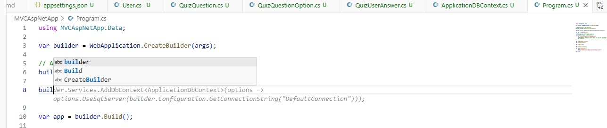

Select tab to accept the suggestion from GitHub Copilot

```bash
builder.Services.AddDbContext<ApplicationDbContext>(options => options.UseSqlServer(builder.Configuration.GetConnectionString("DefaultConnection")));
```

Save the Program.cs file

13. **Build the project** To ensure that everything is correct, run dotnet build from the terminal

```bash
dotnet build
```
If any errors appear, use GitHub Copilot Chat to help fix them by copying the stac trace into the Copilot Chat and asking for suggestions to fix. 

14. **Create the initial database migration** 

Create the initial database migration by going back to the terminal - note that if you are running this from a different IDE such as Visual Studio then the command will be different. The following can be used in VS Code or GitHub Codespaces:
```bash
dotnet ef migrations add InitialCreate
```
When this completes there will be a new 'migrations' folder where you can see that the tables defined in the classes that were created in the Models folder are prepared. 

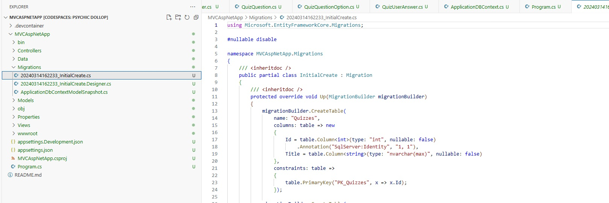

15. **Update the database to apply the migration** 
Update the database to apply the migration by executing the following in the terminal window

```bash
dotnet ef database update
```
As you are running from a Codespace, the following error will occur. 

```bash
Routing Destination:e6a0f222fd58.tr6889.uksouth1-a.worker.database.windows.net,11054
Cannot open server 'utsuipia-sql' requested by the login. Client with IP address '51.140.58.170' is not allowed to access the server.  To enable access, use the Azure Management Portal or run sp_set_firewall_rule on the master database to create a firewall rule for this IP address or address range.  It may take up to five minutes for this change to take effect.
```
You can use GitHub Copilot to help you resolve this by copying the error into the Chat window and asking how to fix it. It is worth trying this to see how you can use GitHub Copilot to troubleshoot. Alternatively go to the '**Troubleshooting Firewall Rule**' section below where it outlines how to fix this. 

Once you have completed the troubleshooting and added the firewall rule for the IP address then execute the command again to apply the migration. 

Once again you might see another problem: 

```bash
Routing Destination:e6a0f222fd58.tr6889.uksouth1-a.worker.database.windows.net,11054
Introducing FOREIGN KEY constraint 'FK_QuizUserAnswers_QuizQuestions_QuizQuestionId' on table 'QuizUserAnswers' may cause cycles or multiple cascade paths. Specify ON DELETE NO ACTION or ON UPDATE NO ACTION, or modify other FOREIGN KEY constraints.
Could not create constraint or index. See previous errors.
```

Again you can use GitHub Copilot to help you resolve this by copying the error into the Chat window and asking how to fix it. Or check out the solution on '**Troubleshooting Cascade Path**' 

Once you have complete the troubleshooting (having cleaned the migration and recreated then the update should work).

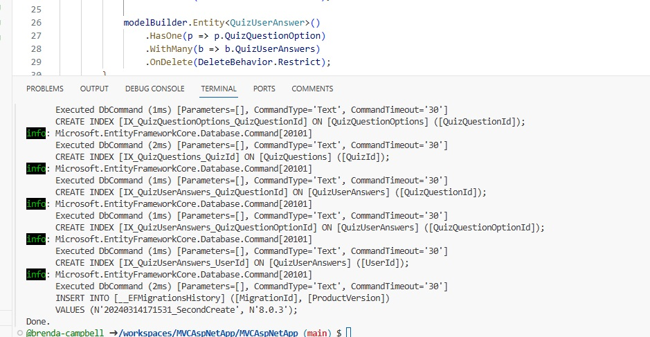

Check back in the SQL Database in https://portal.azure.com/ to verify that the tables are created.

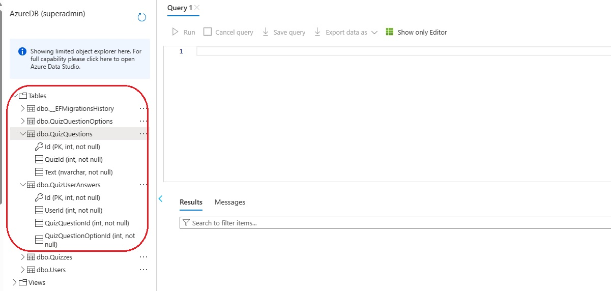


16. **Create the controllers for the model** 
You can use GitHub Copilot to help here if you are not familar with this as this is a way to scaffold MVC controllers with views using Entity Framework for your model classes. 

Ask GitHub Copilot something like 'I want to add MVC Controllers with views using Entity Framework for my model classes User, Quiz, QuizQuestion, QuizQuestionOption, QuizUserAnswer for DbContext class ApplicationDbContext - What are the commands to do this' 

GitHub Copilot will explain what you need to do but you can follow along here too. First you need to dd the package for 'Microsoft.VisualStudio.Web.CodeGeneration.Design'. In the terminal window add the following:

```bash
dotnet add package Microsoft.VisualStudio.Web.CodeGeneration.Design
dotnet tool install --global dotnet-aspnet-codegenerator
```

This may take a few minutes to complete but once this is done then you can generate the controller for each of the model classes. 

For each of your model classes (User, Quiz, QuizQuestion, QuizQuestionOption, QuizUserAnswer), you can run a command similar to the following:

```bash
dotnet aspnet-codegenerator controller -name UsersController -m User -dc ApplicationDbContext --relativeFolderPath Controllers --useDefaultLayout --referenceScriptLibraries
```

Repeat for Quizzes
```bash
dotnet aspnet-codegenerator controller -name QuizzesController -m Quiz -dc ApplicationDbContext --relativeFolderPath Controllers --useDefaultLayout --referenceScriptLibraries
```

Repeat for QuizQuestions
```bash
dotnet aspnet-codegenerator controller -name QuizQuestionsController -m QuizQuestion -dc ApplicationDbContext --relativeFolderPath Controllers --useDefaultLayout --referenceScriptLibraries
```

Repeat for QuizQuestionOptions
```bash
dotnet aspnet-codegenerator controller -name QuizQuestionOptionsController -m QuizQuestionOption -dc ApplicationDbContext --relativeFolderPath Controllers --useDefaultLayout --referenceScriptLibraries
```

Repeat for QuizUserAnswers
```bash
dotnet aspnet-codegenerator controller -name QuizUserAnswersController -m QuizUserAnswer -dc ApplicationDbContext --relativeFolderPath Controllers --useDefaultLayout --referenceScriptLibraries
```

When this is completed then the folder structure should look as shown below. There will be a controller class and views for each of the model classes. 

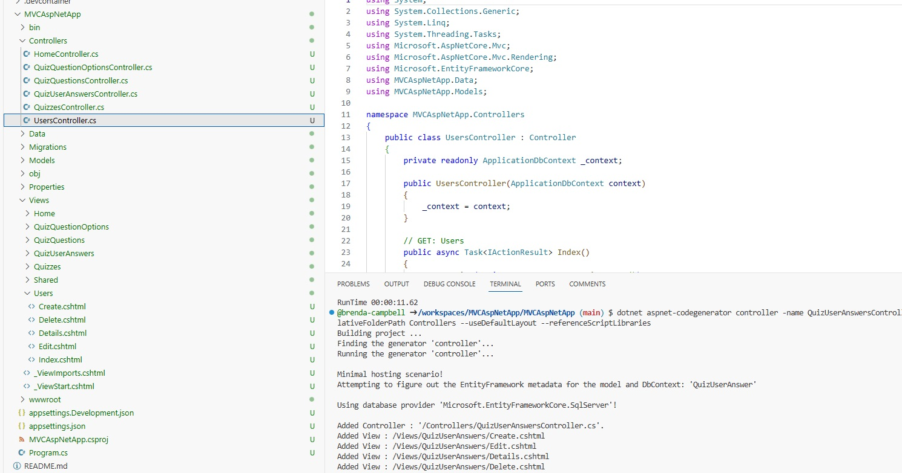


17. **Build the project** 
Using the standard command, build the project using dotnet build

```bash
dotnet build
```

17. **Run the project** 
Using the standard command, execute the project using dotnet run

```bash
dotnet run
```

The Home page will be the standard one but you can check each part of the model by appending '/Users', '/Quizzes', etc,  to the end of the URL 

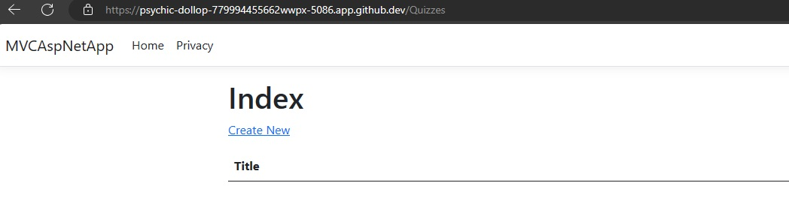

You can create, edit and delete records here but follow the next steps to build out the site.

18. **Update the _Layout** Update the `_Layout.cshtml_` in the Views/Shared folder display the tabs for each model.

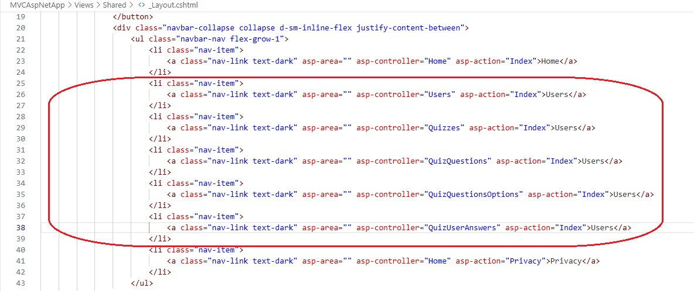


19. **Enhance the project** Use GitHub Copilot to help add any additional styling or functionality to build out the site.

20 **Deploy to Azure App Service** Instructions to follow on how to deploy this. 

## Troubleshooting Firewall Rule
If you encounter an error like "Cannot open server 'evketek6-sql' requested by the login. Client with IP address '51.140.125.85' is not allowed to access the server", you need to create a firewall rule in the Azure portal to allow your IP address to access the server.

The error message might look like the following:
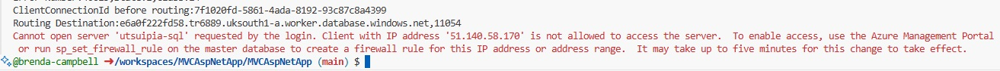

To fix this go to the Azure portal https://portal.azure.com/ and select the SQL Server, navigate to Security section and Networking and 'Add a firewall rule' 

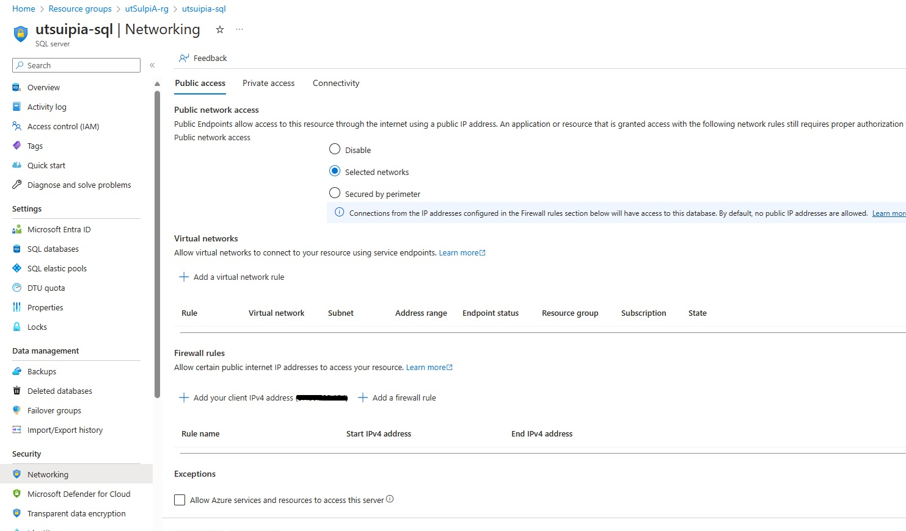

Provide a name for the rule and paste in the IP address from the error message as the Start IP and End IP and press 'OK'.

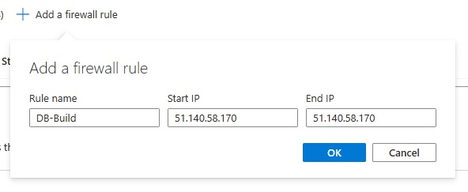

Save the firewall rule so that it is applied:

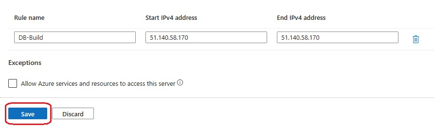

Now go to the SQL Database that was created and select 'Query Editor' to ensure that you can log in. You should know the username and password from https://github.com/hackathon-white-camel-26/deployAzureResources (this is generated by the workflow). 
If there are any queries on username/password then ask coaches at the event to help. 

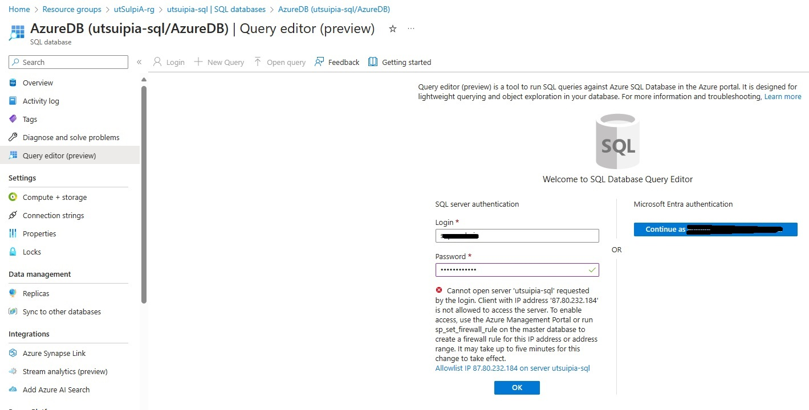

Click on the link below the error message to 'Allowlist IP xx.xx.xxx.xxx on server xxx' . Once applied then click on OK again and you should be able to see the SQL database. Expand Tables and View to see default values.

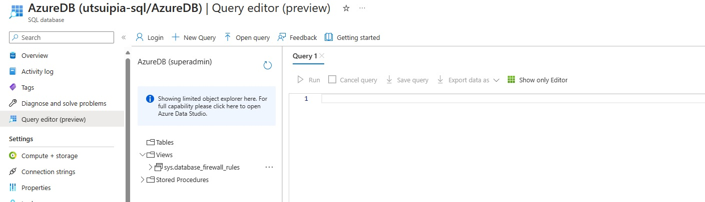


## Troubleshooting Cascade Path
The error message you're seeing is due to SQL Server's limitation that it does not allow multiple cascade paths. This means that if you have a table structure where a row in Table A may cascade delete or update rows in Table B through more than one path, SQL Server will not allow this to protect against the possibility of a cycle occurring in the cascade path.

First delete the migrations to clean up - To delete the migrations you created using dotnet ef migrations add InitialCreate, you can follow these steps:

```bash
dotnet ef migrations remove
```
The migration folder should be empty now. 

To resolve this issue, you can set the onDelete parameter to Restrict in your ForeignKey attribute in your QuizUserAnswer model. This will prevent the cascade delete or update from occurring.

And in your ApplicationDbContext:
```bash
protected override void OnModelCreating(ModelBuilder modelBuilder)
{
    modelBuilder.Entity<QuizUserAnswer>()
        .HasOne(p => p.QuizQuestion)
        .WithMany(b => b.QuizUserAnswers)
        .OnDelete(DeleteBehavior.Restrict);

    modelBuilder.Entity<QuizUserAnswer>()
        .HasOne(p => p.QuizQuestionOption)
        .WithMany(b => b.QuizUserAnswers)
        .OnDelete(DeleteBehavior.Restrict);
}
```
 so the full class should be like:

 ```bash
using MVCAspNetApp.Models;
using Microsoft.EntityFrameworkCore;

namespace MVCAspNetApp.Data
{
    public class ApplicationDbContext : DbContext
    {
        public ApplicationDbContext(DbContextOptions<ApplicationDbContext> options)
            : base(options)
        {
        }

        public DbSet<User> Users { get; set; }
        public DbSet<Quiz> Quizzes { get; set; }
        public DbSet<QuizQuestion> QuizQuestions { get; set; }
        public DbSet<QuizQuestionOption> QuizQuestionOptions { get; set; }
        public DbSet<QuizUserAnswer> QuizUserAnswers { get; set; }

        protected override void OnModelCreating(ModelBuilder modelBuilder)
        {
            modelBuilder.Entity<QuizUserAnswer>()
                .HasOne(p => p.QuizQuestion)
                .WithMany(b => b.QuizUserAnswers)
                .OnDelete(DeleteBehavior.Restrict);

            modelBuilder.Entity<QuizUserAnswer>()
                .HasOne(p => p.QuizQuestionOption)
                .WithMany(b => b.QuizUserAnswers)
                .OnDelete(DeleteBehavior.Restrict);
        }
    }
}
```

Once you have added this then you need to re-run the creation.

```bash
dotnet ef migrations add SecondCreate
```
When this completes the 'migrations' folder will be updated. 

## Running the Project
To run the project, use the following command in the terminal:
```bash
dotnet run
```
This will start the application and it will be accessible at `http://localhost:5000`.
